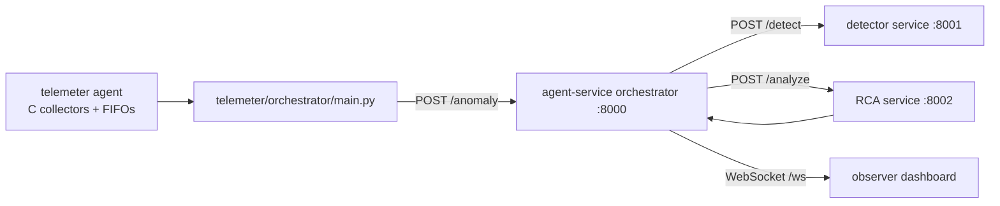

# SuperCloud

Central documentation for the full repository workflow.

## What this repo contains

- `telemeter/` → C-based telemetry + log collection, then Python forwarding/orchestration.
- `agent-service/` → FastAPI microservices for detector (`8001`), RCA (`8002`), orchestrator (`8000`).
- `observer/` → React/Vite dashboard UI, served on `80` in Docker.
- `backend/` → TypeScript/Express incident workflow + Prisma persistence (currently separate from the Docker runtime path).

## High-level architecture



## End-to-end runtime workflow (main Docker path)

1. `telemeter` starts and runs `entrypoint.sh`.
2. C collectors produce metrics/logs into FIFOs under `telemeter/agent/fifo/`.
3. `telemeter/orchestrator/main.py` reads FIFO data, detects anomalies, and posts payloads to `http://orchestrator:8000/anomaly`.
4. Orchestrator (`agent-service`) forwards telemetry to detector (`/detect`).
5. If detector decides `action=alert`, orchestrator creates an incident context.
6. If `trigger_rca` is true, orchestrator calls RCA (`/analyze`) for LLM-based root-cause classification.
7. Orchestrator keeps incident state in memory and exposes:
   - `GET /health`
   - `GET /status`
   - `WS /ws` for streaming UI events
8. `observer` dashboard connects to `ws://localhost:8000/ws` and renders live panels.

## Backend workflow (currently parallel/separate)

The `backend/` service implements a separate incident lifecycle backed by Postgres/Prisma:

1. Receive alert at `POST /ingest/alert`.
2. Normalize source payload (`PROMETHEUS | LOKI | TEMPO | GRAFANA`).
3. Run incident workflow:
   - persist incident
   - record audit events
   - choose agent (mocked response today)
   - evaluate policy
   - execute remediation (simulated)
   - persist execution + resolve incident
4. Query state via:
   - `GET /incidents`
   - `GET /audit/:incidentId`

> Note: root Docker compose does not currently run `backend/` or a database. Use backend in local/dev mode separately.

## Service map

| Component | Runtime | Port | Key endpoint(s) |
|---|---|---:|---|
| telemeter | Docker | n/a | sends to orchestrator `/anomaly` |
| detector | FastAPI | 8001 | `POST /detect`, `GET /health` |
| rca | FastAPI | 8002 | `POST /analyze`, `GET /health` |
| orchestrator | FastAPI | 8000 | `POST /anomaly`, `GET /status`, `WS /ws` |
| observer | Nginx + React | 80 | dashboard UI |
| backend | Express | 3000 (default) | `/ingest`, `/incidents`, `/audit` |

## Quick start

### 1) Main stack (recommended)

From repo root:

```bash
docker compose up --build
```

Then open:

- Observer UI: `http://localhost`
- Orchestrator API: `http://localhost:8000/health`
- Detector API: `http://localhost:8001/health`
- RCA API: `http://localhost:8002/health`

### 2) Run backend separately (optional)

From `backend/`:

```bash
npm install
npm run dev
```

Set env before starting backend:

- `DATABASE_URL=<postgres-connection-string>`
- `PORT=3000` (optional)

## Important implementation notes

- RCA requires `GROQ_API_KEY` (loaded in `agent-service/agents/rca_brain/rca.py`).
- Auto-remediation in agent orchestrator is currently disabled by default (`enable_auto_remediation: false`).
- `observer` logs panel currently uses synthetic logs and also listens to WebSocket log events.
- Telemeter currently posts logs to `http://orchestrator:8000/ws` using HTTP in `telemeter/orchestrator/main.py`; orchestrator exposes `WS /ws` and `POST /internal/event` for event ingestion.

## Folder-level entrypoints

- Telemeter entrypoint: `telemeter/entrypoint.sh`
- Telemeter forwarder: `telemeter/orchestrator/main.py`
- Agent orchestrator API: `agent-service/agents/orchestrator/services/orchestrator_service.py`
- Detector API: `agent-service/agents/detector/detector_service.py`
- RCA API: `agent-service/agents/rca_brain/rca_service.py`
- Backend app: `backend/src/app.ts`
- Observer page shell: `observer/src/pages/Index.tsx`
